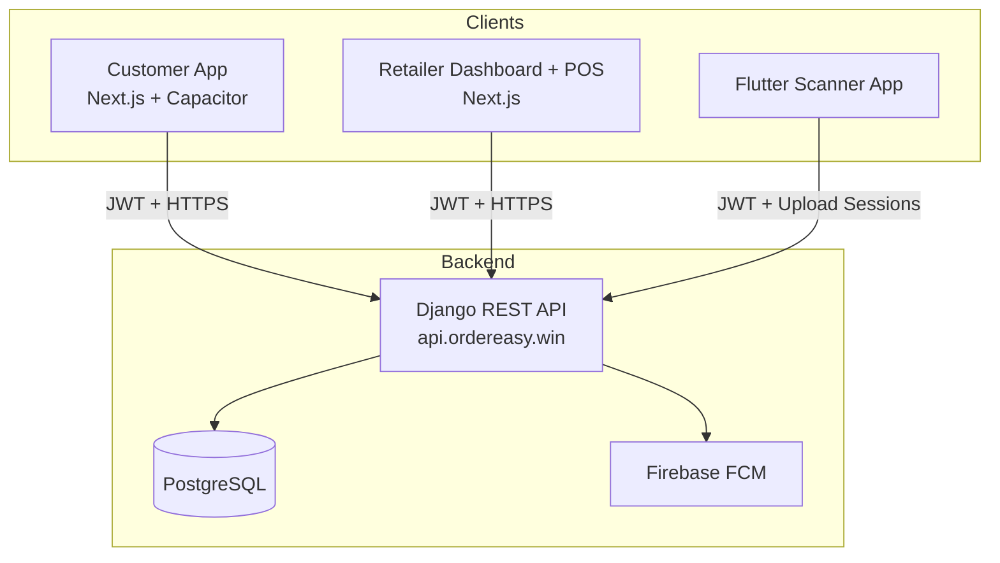

# 02 – System Architecture

## Overview

The platform follows a classic **API-first** architecture. All client applications (Customer App, Retailer Dashboard/POS, and Scanner) communicate exclusively with the central Django backend via HTTPS + JWT authentication.

## High-Level Architecture

*Illustrative diagram: Customer App, Retailer Dashboard + POS, and Flutter Scanner App all talk to the central Django REST API at `api.ordereasy.win` using JWT authentication.*

### Key points

- **API Gateway / Backend**: Single Django + DRF application that owns all business logic, data models, and rules.
- **Database**: PostgreSQL (with trigram extensions for search).
- **Notifications**: Firebase Cloud Messaging (FCM) for push notifications.
- **Authentication**: JWT (access + refresh tokens) + OTP flows.
- **Clients** are thin: they handle UI/UX and call the API. No business logic is duplicated in the frontends. Route map: [05-API-SURFACE.md](05-API-SURFACE.md). Plain-language map: [wiki/project/apis.md](../wiki/project/apis.md).

## Component Responsibilities

| Component | Responsibility |
|-----------|----------------|
| Backend (`RetailerCustomerPlatform`) | Auth, Products, Batches, Inventory, Cart, Orders, Offers engine, Loyalty, Credit/Khata, Purchases, Returns, Scanner upload sessions |
| Customer App | Discovery, catalog browsing, cart, checkout, order tracking, rewards, chat |
| Retailer Dashboard + POS | Order management, POS billing, browser-print barcode/display labels, product & batch management, purchases, offers, customer CRM, reports. Label HTML and POS UPI QR are client-side (shop UPI ID). |
| Scanner App | Barcode scanning, pack photo, master-catalog lookup, upload sessions for bulk product creation. OCR form code exists but is unused on the live path. |

## Data Flow Principle

All state changes go through the backend. The frontends never write directly to the database. This ensures a single source of truth for inventory, pricing, offers, and order status.

Documentation for this architecture lives in Git (`docs/`). GitBook is optional presentation. See [DOCUMENTATION.md](DOCUMENTATION.md).
