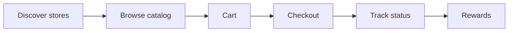
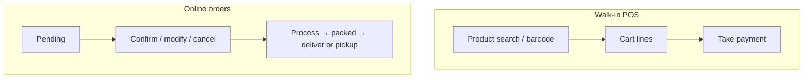
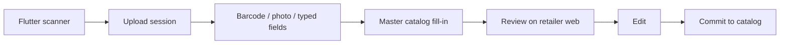

# 03 – User journeys

Illustrative journeys for humans and agents. Images contain **no real customer data**. Text and Mermaid are the source of the rules; JPGs are supporting visuals.

Related work: [KAN-53](requirements/retailer-store-location.md), [KAN-54](requirements/customer-location-at-start.md), [KAN-69](requirements/customer-retailer-city-map.md). Ticket snapshots stay under [`tickets/`](tickets/).

## Customer journey

*Discover nearby stores → browse catalog → cart → checkout → track order → rewards.*

**Key points**

- Customers use `customer_ordereasy_njs` (web + Capacitor) against the Django API.
- Guest cart exists before signup; tokens must not wipe it (see [guest-cart-signup.md](07-KEY-FLOWS/guest-cart-signup.md)).
- At start, the app should ask for location rather than forcing a manual pin first ([customer-location-at-start.md](requirements/customer-location-at-start.md)). Manual override may remain.
- Discovery is a city map centred on the customer, with unpinned shops parked at the map edge and a nearest-first list as the fallback ([customer-retailer-city-map.md](requirements/customer-retailer-city-map.md)).
- Pickup and delivery are `Order.delivery_mode` on the backend. There is **no** separate delivery/rider app ([ADR-001](decisions/ADR-001-no-delivery-app.md)).

## Retailer POS and online orders

*POS terminal for walk-in billing plus online order status handling in the retailer app.*

**Key points**

- Retailer app: `retailer_ordereasy_njs` at `https://retailer.ordereasy.win`.
- POS customer typeahead lists **this retailer’s customers only**, with name ([pos-customer-typeahead.md](requirements/pos-customer-typeahead.md)).
- POS exact-amount UPI QR is built in the browser from the shop’s saved UPI ID (no payment-processor API).
- Print Labels / Display Labels are browser print HTML.
- Store pin is set in the retailer app ([retailer-store-location.md](requirements/retailer-store-location.md)).
- Order status rules live in [order-lifecycle.md](07-KEY-FLOWS/order-lifecycle.md).
- API route map: [05-API-SURFACE.md](05-API-SURFACE.md).

## Scanner to catalog

*Flutter scanner → upload session → barcode + photo (+ master catalog lookup) → review on web → commit to catalog.*

**Key points**

- Scanner is `buyeasy_retailer_scanner` (Flutter + ML Kit). It talks to the same Django API via upload sessions.
- Live capture is **barcode + optional master-catalog fill-in + pack photo + typed fields**. `OCRProductFormScreen` is unused — do not document OCR as the daily path.
- Catalog truth is the backend, not the scanner device.
- After commit, shops often print **barcode stickers** from retailer Print Labels (browser print HTML, not an API).
- Crash/logging work for intensive scanning is **ticket work**, not a durable architecture change: [tickets/KAN-18.md](tickets/KAN-18.md).
