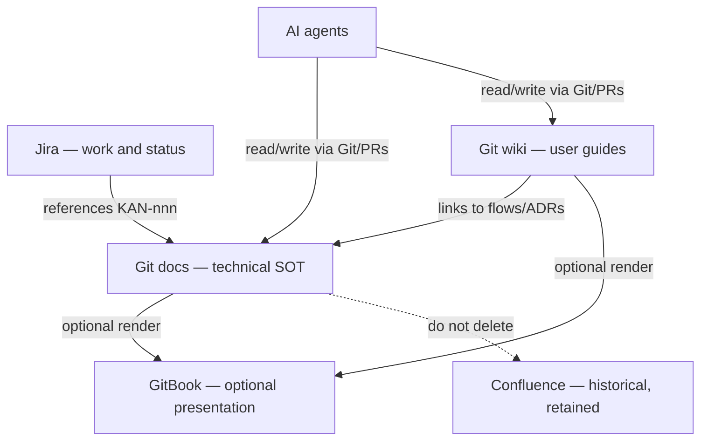

# Documentation architecture

This repository’s `docs/` tree is the **canonical source of truth** for OrderEasy / BuyEasy **technical** knowledge. The sibling **`wiki/`** tree is the **user-facing help centre** (retailers, customers, end-to-end product guides).

GitBook is an optional rendering layer. Confluence is preserved as historical documentation. Jira tracks work, not knowledge.

## Who answers what

| System | Answers |
|--------|---------|
| **Jira** | What work is this? Who owns it? What is the status? |
| **Git `wiki/`** | How do retailers and customers use the product? FAQ, guides, full project map |
| **Git `docs/`** | Architecture, flows, ADRs, requirements, ticket snapshots |
| **Git code** | What actually exists? |
| **Git history / PRs** | What changed, and who reviewed it? |
| **GitBook** | Optional human-friendly presentation of Git (and older Confluence copies). Not required to understand the product. |
| **Confluence** | Historical / existing pages. Copy, don’t replace. Do not delete as part of docs work. |
| **AI agents** | Read and update `wiki/` and `docs/` through Git/PRs. |

## How to use this tree

**Retailers and customers:** start at [wiki/README.md](../wiki/README.md) and [wiki/SUMMARY.md](../wiki/SUMMARY.md).

**Engineers and agents — technical docs:**

1. [00-INDEX.md](00-INDEX.md) — map of knowledge objects
2. This file — source-of-truth rules
3. [tickets/README.md](tickets/README.md) — Jira snapshots vs durable knowledge

Rules for agents and humans:

- Prefer **one focused document per knowledge object**. Do not grow a single “everything” page.
- Put durable rules, flows, and ADRs in `requirements/`, `07-KEY-FLOWS/`, `decisions/`, or architecture docs — **not** only inside `tickets/KAN-nnn.md`.
- Keep `tickets/KAN-nnn.md` as a **work snapshot** (acceptance context, links). Jira remains the status system.
- Every important visual needs a **textual explanation**. Prefer Mermaid when the diagram can live as code. Keep useful JPG/PNG/SVG in `visuals/` with repository-relative links.
- Link Jira as `KAN-nnn`. Do not paste entire tickets into docs.
- Change docs on a branch and open a PR. Do not treat GitBook or Confluence as the place to make the lasting edit.
- Do not introduce GitBook-only content. Do not delete Confluence. Do not remove Confluence links from Jira.

## Repository ownership

| Knowledge | Canonical location |
|-----------|-------------------|
| User guides, FAQ, onboarding, end-to-end product map | **This repo** `RetailerCustomerPlatform/wiki/` |
| Platform architecture, flows, visuals, ADRs, requirements extracted from tickets | **This repo** `RetailerCustomerPlatform/docs/` |
| App-specific UI implementation notes | Prefer the app repo README; link from here if it is durable |
| Ticket work snapshots (18 migrated Confluence pages) | `docs/tickets/` in **this** repo so one clone is enough for agents |

Related app repos (code, not the docs SOT): `customer_ordereasy_njs`, `retailer_ordereasy_njs`, `buyeasy_retailer_scanner`.

## What we did not do

- Did not delete or archive Confluence.
- Did not remove Confluence or GitBook links from Jira.
- Did not publish the GitBook site publicly.
- Did not restructure the existing `00`–`07` technical docs into wiki pages — `wiki/` is a separate user layer that links to `docs/` where needed.

## Migration history

See [gitbook-migration/README.md](gitbook-migration/README.md). Preserve those files; they explain Track A (Confluence → GitBook) and Track B (Git KB → GitBook).
